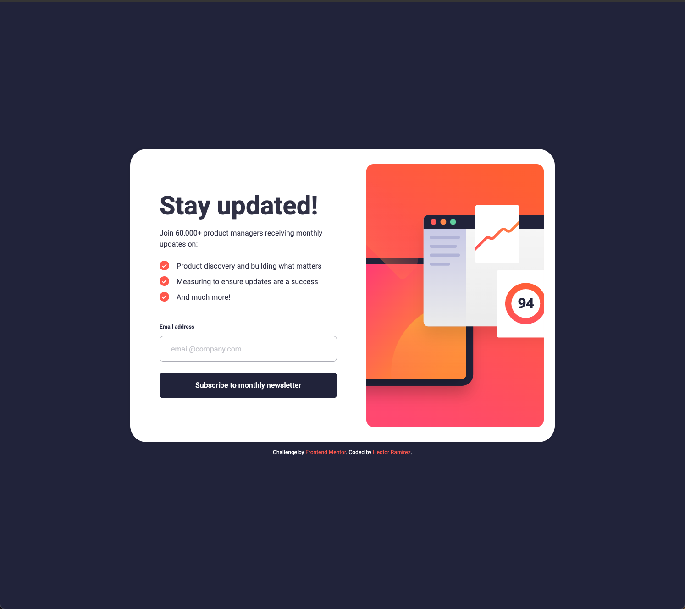
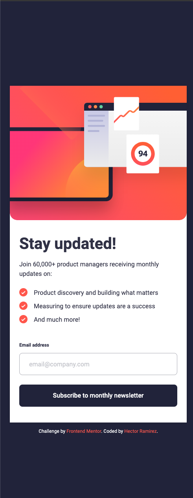

# Frontend Mentor - Newsletter sign-up form with success message solution

This is a solution to the [Newsletter sign-up form with success message challenge on Frontend Mentor](https://www.frontendmentor.io/challenges/newsletter-signup-form-with-success-message-3FC1AZbNrv). Frontend Mentor challenges help you improve your coding skills by building realistic projects.

## Table of contents

- [Overview](#overview)
  - [The challenge](#the-challenge)
  - [Screenshot](#screenshot)
  - [Links](#links)
- [My process](#my-process)
  - [Built with](#built-with)
  - [What I learned](#what-i-learned)
  - [Continued development](#continued-development)
  - [Useful resources](#useful-resources)
- [Author](#author)

## Overview

### The challenge

Users should be able to:

- Add their email and submit the form
- See a success message with their email after successfully submitting the form
- See form validation messages if:
  - The field is left empty
  - The email address is not formatted correctly
- View the optimal layout for the interface depending on their device's screen size
- See hover and focus states for all interactive elements on the page

### Screenshot




### Links

- Solution URL: [Solution](https://github.com/hectorlil48/newsletter-sign-up-with-success-message)
- Live Site URL: [Live site](https://hectorlil48.github.io/newsletter-sign-up-with-success-message/)

## My process

### Built with

- Semantic HTML5 markup
- CSS custom properties
- Flexbox
- Mobile-first workflow
- Javascript

### What I learned

I've made significant progress during this project. I've gained a better understanding of using alt text and aria labels to enhance the accessibility of my HTML. My CSS skills have also improved, making it easier for me to create styles and ensuring responsiveness with less effort. I'm becoming more confident in writing CSS. In this project, I utilized JavaScript to validate the email input, and upon successful validation, it directed the user to the success page. While I faced some challenges, revisiting the frontend mentor learning path greatly aided me in email validation and adjusting styles in case of errors.

```html
<button class="submit" aria-label="Subscribe to newsletter">
  Subscribe to monthly newsletter
</button>
```

```css
.subscribe-form input.input-error {
  border-color: var(--red);
  color: var(--red);
  background-color: var(--red-transparent);
}
```

```js
function isValidEmail(email) {
  // Basic email validation regex
  const emailPattern = /^[a-zA-Z0-9._%+-]+@[a-zA-Z0-9.-]+\.[a-zA-Z]{2,}$/;
  return emailPattern.test(email);
}
```

### Continued development

In future projects, I plan to continue working with CSS to enhance my skills and incorporate new styles such as animations and advanced positioning. I will also focus on improving the accessibility and cleanliness of my HTML. Additionally, I aim to enhance my proficiency in JavaScript by solving more algorithms to gain a deeper understanding of the language.

### Useful resources

- [Google](https://www.google.com/) - Google is helpful in many ways. I often use Google to find answers to my questions and it provides a variety of helpful links. Additionally, its AI feature delivers accurate responses.
- [W3schools](https://www.w3schools.com/) - W3Schools is incredibly useful whenever I need to quickly reference how to implement margins, spacing, or other CSS and JavaScript functionalities. Its clear examples and concise explanations make it my go-to resource for coding questions and learning new techniques.

## Author

- GitHub - [Hector Ramirez](https://github.com/hectorlil48)
- Frontend Mentor - [@hectorlil48](https://www.frontendmentor.io/profile/hectorlil48)
- LinkedIn - [@linkedin.com/in/hector-ramirez-6a6509170](https://www.linkedin.com/in/hector-ramirez-6a6509170/overlay/contact-info/)
